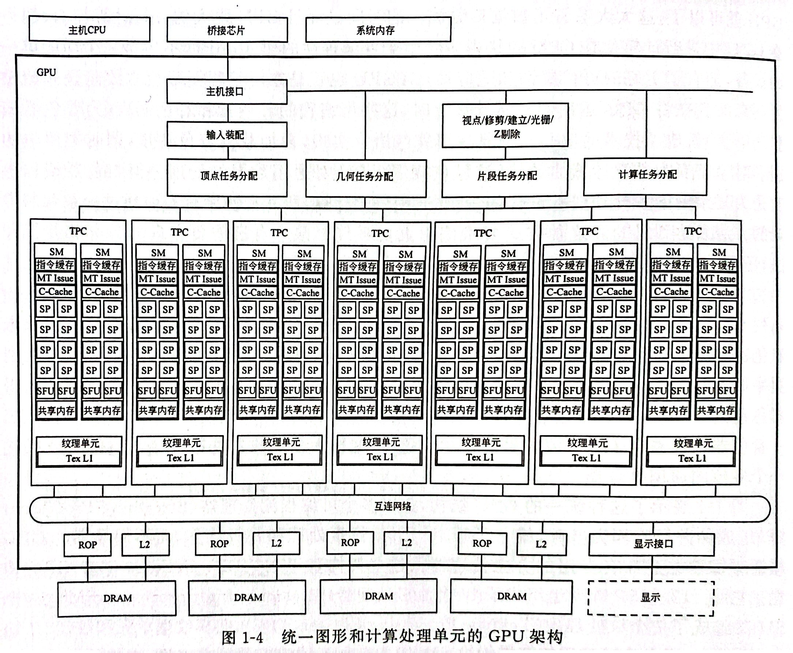

# GPGPU Design

参考：

- [通用图形处理器设计 - GPGPU 编程模型与架构原理](https://book.douban.com/subject/35998320/)

阅读资料：

- [A Case Study in Reverse Engineering GPGPUs: Outstanding Memory Handling Resources](https://doi.org/10.1145/2927964.2927968)
- [Dissecting GPU Memory Hierarchy Through Microbenchmarking](https://doi.org/10.1109/TPDS.2016.2549523)
- [In-depth analyses of unified virtual memory system for GPU accelerated computing](https://doi.org/10.1145/3458817.3480855)
- Non-uniform memory access
  - [EN-WIKI](https://en.wikipedia.org/wiki/Non-uniform_memory_access)
  - [An Overview: NUMA becomes more common because memory controllers get close to execution units on microprocessors.](https://doi.org/10.1145/2508834.2513149)
  - [Construction and optimization of heterogeneous memory system based on NUMA architecture](https://doi.org/10.1109/ICSP54964.2022.9778754)

GPGPU 常用术语对照表

| 本书用语       | CUDA                     | OpenCL         |
| -------------- | ------------------------ | -------------- |
| 线程           | thread                   | work-item      |
| 线程束         | warp                     | wavefront      |
| 线程块         | thread block             | work-group     |
| 线程网格       | grid                     | NDRange        |
| 协作组         | cooperative groups       | N/A            |
| 可编程多处理器 | streaming multiprocessor | CU             |
| 可编程流处理器 | streaming processor      | PE             |
| 张量核心       | tensor core              | matrix core    |
| 局部存储器     | local memory             | private memory |
| 共享存储器     | shared memory            | local memory   |

| 存储空间类型             | CUDA            | OpenCL          |
| ------------------------ | --------------- | --------------- |
| 所有线程均可访问         | global memory   | global memory   |
| 只读存储器               | constant memory | constant memory |
| 只有线程块内线程可以访问 | shared memory   | local memory    |
| 只有线程本身可以访问     | local memory    | private memory  |

> 如果不加说明，本文默认使用 CUDA 和 Nvidia GPGPU 进行描述

# 概述

GPU 的历史，可以阅读英伟达发表的 [文章](https://doi.org/10.1109/MM.2021.3113475 "Evolution of the Graphics Processing Unit (GPU)")，也可以参考 Jon Peddie 所著 [书籍](https://doi.org/10.1007/978-3-031-10968-3 "The History of the GPU - Steps to Invention")。

英伟达 GPU 的主要参数可以参考 [EN-WIKI](https://en.wikipedia.org/wiki/List_of_Nvidia_graphics_processing_units "List of Nvidia Graphics Processing Units")。
AMD GPU 可以参考 GCN，RDNA 等架构白皮书。



## 并行计算机

> “并行计算机是一些处理单元的集合，他们通过通信和协作快速解决一个大的问题。”
> —— Almasi and Gottlieb

“处理单元”是指具有指令处理和计算能力的逻辑电路，它定义了并行计算的功能特性。可以是一个 `ALU`，也可以是一个 `Processor Core`，`Processor Chip` 或者整个 `Compute Node`。
“处理单元的集合”则定义了并行计算具有一定的规模性。

“通信”是指处理单元彼此之间的数据交互。该机制明确了两类重要的并行体系结构：`共享存储结构`、`消息传递结构`。
“协作”是指并行任务在执行过程中相对于其他任务的同步关系，约束了计算机进行多任务处理的顺序，保障其正确性。
“快速解决一个大的问题”则意味着并行计算机设计目的是性能。

从该定义看，GPGPU 体系结构也符合并行计算机的定义。

## 并行体系结构

Flynn 在 1972 年对不同类型的并行性进行了 [研究](https://doi.org/10.1109/PROC.1966.5273 "Very High-Speed Computing Systems")，他根据指令流和数据流的关系定义了并行计算机的类型 [EN-WIKI](https://en.wikipedia.org/wiki/Flynn%27s_taxonomy "Flynn's Taxonomy")。

指令流是由 **单个程序计数器** 产生的 **指令序列**，数据流是指指令所需的数据及其 **访问地址** 的序列，包括输入数据、中间数据和输出数据。

可以参考: 

| 类别 | 代表                                            |
| ---- | ----------------------------------------------- |
| SISD | 传统单核 CPU                                    |
| SIMD | 向量处理器；部分微处理器和 GPGPU 也有 SIMD 能力 |
| MISD | 脉动阵列（Systolic Array）结构                  |
| MIMD | 大多数多核 CPU                                  |

根据实现层次不同，并行体系结构可以有很多实现方式：

- 最基本的方式是单核内指令级并行（ILP），即处理器同一时刻可以处理多条指令。`Pipeline` 流水线技术是实现指令级并行的关键使能技术。
- 在 ILP 基础上是多线程和多核并行，即一个芯片上紧密集成多个处理单元或处理核心，同时处理多个任务。
- 再上一个层次是多计算机并行，即将多个芯片通过专用的网络连接在一起实现更大规模的并行。
- 更高层次的并行是仓储级计算机（Warehouse-Scale Computer，WSC），即借助互联网技术将数以万计的处理器和计算机节点连接在一起。每个节点可能是一个独立的计算机，并具备前述多种层面的并行。


# GPGPU 编程

CUDA: Compute Unified Device Architecture 计算统一设备体系结构

OpenCL: Open Computing Language 开发运算语言

本节介绍 GPGPU 编程模型和编程注意点。

## 计算模型

在 GPGPU 中，承担并行计算中每个计算任务的计算单元称为线程。
每个线程在一次计算任务中会执行相同的指令。
虽然每个线程可能有不同的输入，输出的结果也不同，但是执行的指令却完全相同。
也就是说，一条指令被多个线程同时执行，但是数据不一定相同。
该模式在 GPGPU 中称呼为 `单指令多线程`（Single Instruction Multiple Thread，SIMT）计算模型。

在 GPGPU 编程模型中，通常将代码划分为主机端（Host）代码和设备端（Device）代码，分别运行在 CPU 和 GPGPU 上。该划分通常为手工编码指定。
CPU 执行主机代码。
GPGPU 将根据代码中给定的线程网格组织方式等参数，将设备端代码进一步分发到线程中。

主机端代码通常分为三个步骤：

1. 数据复制
2. GPGPU 启动
3. 数据写回

设备端代码常常由多个被称为内核函数（Kernel）的函数组成。
内核函数会被分配到每个 GPGPU 线程中执行，而线程的数量由编程人员根据算法和数据的维度，显式指定。
一方面，GPGPU 的线程模型定义了如何利用大规模多线程 **索引** 到计算任务中的不同数据；
另一方面，线程组织与 GPGPU 层次化的硬件结构相对应。
因此，GPGPU 所定义的线程模型成为 **计算任务和硬件结构之间的桥梁**，使得 GPGPU 的编程模型在保持较高的抽象层次同时，也能够完成计算任务向硬件结构的高效映射。

一个内核函数的定义可以是如下的格式：

``` c++
/*
 * @param DimGrid   配置线程网格组织信息
 * @param DimBlock  配置线程块组织信息
 * @param NumSharedMemory   配置除了静态分配的 Shared Memory 外
                            最多能动态分配的 Shared Memory 大小
                            单位为 byte。
                            不需要动态分配时，写 0 或省略不写
 * @param Stream    绑定的 cuda 流
 */
__device__ kernel<<<DimGrid, DimBlock, NumSharedMemory, Stream>>>( argument-list );
```

线程网格是最大的线程范围，包含了主机端代码启动内核函数时唤醒的所有线程。
线程网格由多个线程块组成，其数量由上述的 `DimGrid` 参数指定。`DimGrid` 是一个 `dim3` 类型的数据。

线程块是线程的集合。为了按照合适的粒度将线程划分为硬件单元，GPGPU 编程模型将线程组合成为线程块，块内线程可以互现通信。
与线程网格类似，线程块也由一个 `dim3` 类型的 `DimBlock` 参数指定。

> `dim3` 数据类型是由 CUDA 定义的关键字，它本质上是一个数组，拥有 3 个无符号整型字段代表块的维度为三维，其组织结构为 x 表示行，y 表示列，z 表示高。

线程是最基本的执行单元。


基于上述的线程层次，线程需要能够寻找到自己的具体位置，才能够知道该加载何处的数据，然后将数据放到何处。
在 CUDA 中，每个线程可以通过 `blockIdx`（线程块索引号）和 `threadIdx`（线程索引号）的 x，y，z 信息唯一确定自己的位置。

> 由 `__shared__` 作为前置说明符的变量被分配到共享存储器中，可以为同一个线程块内的线程提供更快的数据访问，比全局存储器更快。

为了实现对大量线程的分配，GPGPU 对硬件功能单元进行了层次化的组织。
GPGPU 的硬件层次化结构，主要由流多处理器阵列和存储系统组成，两者由片上网络连接到 L2 高速缓存和设备端存储器上。

每个流多处理器内部有多个流处理器单元，构成一套完整的指令流水线，包含取值、译码、寄存器文件及数据加载/存储单元等，并以 SIMT 架构的方式进行组织。

当内核函数被唤醒时，GPGPU 接受相应的线程网格，并以线程块为单位将不同的线程块分配给流多处理器。
GPGPU 架构不同，每个流多处理器能够接受的线程块数量也不同。

分配逻辑基本如下（标注处的信息与架构有关）：

1. 按照架构特性，向每个流多处理器分配 `不多于最大数量` 的线程块
2. 当线程块被分配到特定的流多处理器之后，该线程块内的线程会被分为以 `固定数量` 的线程组成的线程束
3. 线程束会被分配给当前流多处理器中的流处理器执行
4. 同一个线程束中的所有线程运行相同的指令，但是每个线程依据各自的 `threadIdx` 和 `blockIdx` 索引到各自的数据进行处理

以上的过程便实现了 SIMT 计算模型。值得注意的是，虽然上述行为与 GPU 架构有关，但是分配过程完全由硬件执行，对编程人员是完全透明的。

## 存储模型

在 CUDA 中，
每个线程都拥有自己独立的存储空间，包括寄存器文件和局部存储器，这些空间只有 **本线程** 才能访问；
每个线程块允许内部线程访问共享存储器，在块内进行线程间通信；
线程网格内部的所有线程都能访问全局存储器，也可以访问纹理存储器和常量存储器中的数据。

不同存储器层次的访问带宽差别显著，线程代码可以从不同存储空间访问数据，以提高内核函数额执行性能。


### 寄存器文件

寄存器文件（Register File，RF）是流多处理器片上存储器中最为重要的一个部分，它提供了与计算内核相匹配的数据访问速度，多采用 SRAM 进行设计。

GPGPU 会将寄存器静态地分配给每个线程，使得每个线程都可以配备一定数量的寄存器，防止寄存器溢出所导致的性能下降。
所以 GPGPU 会提供大容量的寄存器文件，能够让更多的线程同时保持在活跃状态。
如此大容量的寄存器文件往往只能采用高密度的静态存储器阵列进行搭建，以减小面积和功耗。

当流水线遇到长延时操作的时候，GPGPU 可以在多个 **线程束** 之间快速地切换来保持流水线始终处于工作状态，而不需要像 CPU 那样进行耗时的上下文切换。
这种特性在 GPGPU 中被称为 **零开销线程束切换**（Zero-Cost Warp Switching），可以有效地掩藏长延时操作，避免流水线停顿。

> [!TIP]
> 由SM处理的每个线程束的执行上下文，在整个线程束的生存期中是保存在芯片内的。
> 因此，从一个执行上下文切换到另一个执行上下文没有损失。
> 同时，由于这个特性，多个线程束对寄存器的消耗也非常大。

可参考 [文献](https://doi.org/10.1145/3419973 "Highly Concurrent Latency-tolerant Register Files for GPUs")。

寄存器文件采用多个板块（Bank）的单端口 SRAM 来模拟多端口的访问。
由于其总容量非常大，每个逻辑板块还会被进一步拆分为更小的物理板块。

GPGPU 会以线程束所包含的线程数量 N 为单位，将 N 个寄存器打包成线程束寄存器（Warped Register）并分散到各个板块里，进行统一读取和写入以提高效率。

因为单端口板块不能支持并行访问，所以会有板块冲突（Bank Conflict）问题，使得效率降低。
为缓解该问题，使用了如下的方法：

1. 使用操作数收集器（Operand Collector）以提高效率
2. 寄存器板块交错分布，降低板块冲突可能

> 同时由于板块冲突等问题，会引发 WAR 冒险：
> 
> 依次运行 A 和 B 两条指令，A 和 B 之间有 WAR 关系。
> A 由于板块冲突一直无法发射，而 B 在这过程中完成了所有计算并准备写回。
>
> 而 RAW 和 WAW 则会由记分牌阶段解决，不会在该阶段出现。
>
> 为解决这个问题，有多种方案，如：
> 
> 1. 约束每个线程束顺序执行且最多执行一条指令
> 2. 可以约束每个线程束每次仅允许一条指令在操作数收集器中收集数据

其他优化设计办法：

- [增加前置寄存器文件缓存的设计](https://doi.org/10.1145/2000064.2000093 "Energy-efficient mechanisms for managing thread context in throughput processors")
- [基于嵌入式动态存储器的寄存器文件设计](https://doi.org/10.1145/2508148.2485952 "An energy-efficient and scalable eDRAM-based register file architecture for GPGPU")
  - 首次提出利用非 `SRAM` 的 `eDRAM` 设计 RF，基于该创新，后续出现了使用 `STT-RAM`，`Racetrack Memory`，`Carbon NanoTube Field-Effect Transistor`（CNTFET）或混合结构来改良 RF 或其他大容量片上存储的设计
  - [STT-RAM](https://doi.org/10.1145/2744769.2744785 "A STT-RAM-based low-power hybrid register file for GPGPUs")
  - [Racetrack Memory](https://doi.org/10.1109/TC.2017.2690855 "An Energy-Efficient GPGPU Register File Architecture Using Racetrack Memory")
  - [CNTFET](https://doi.org/10.1109/ICCD.2016.7753354 "CNFET-based high throughput register file architecture")
  - [STT-RAM/SRAM hybrid](https://doi.org/10.1109/ICCAD.2017.8203850 "Towards warp-scheduler friendly STT-RAM/SRAM hybrid GPGPU register file design")
- [利用数据压缩的寄存器文件设计](https://doi.org/10.1145/2749469.2750417 "Warped-Compression: Enabling power efficient GPUs through register compression")
- [编译信息辅助的小型化寄存器文件设计](https://doi.org/10.1145/3123939.3123974 "RegLess: Just-in-Time Operand Staging for GPUs")

### 局部存储器

每个线程除了访问分配的寄存器外，还拥有自己独立的存储空间，即局部存储器（Local Memory）。
局部存储器是私有的，**只有本线程** 才能进行读写。

一般情况下，如果线程发生寄存器溢出，或使用了大型的局部数据结构，或编译器无法静态的确定数据的大小时候，这些变量就会被分配到局部存储器中。

由于不确定其容量，**局部存储器的数据实际上会被保存在全局存储器中**，而不像寄存器那样是片内独立的存储资源，因此其读写代价十分高昂。
一般会采用 L1 和 L2 高速缓存对局部存储器的访问进行优化。

> [!WARNING]
> 按照这里所说，局部存储是逻辑上存在的，实际上是在全局存储器上。
> 需要进一步了解。

> 在 CUDA 编译时可以通过输出汇编代码以及增加 `-ptxas-options=-v` 选项来观察局部存储器的使用情况。

### 共享存储器

共享存储器（Shared Memory）也是流多处理器片内的高速存储资源，它由一个 **线程块内部** 的所有线程共享。
相比于全局存储器，共享存储器能够以类似于寄存器的访问速度读写其中的内容，而且可以根据编程人员的需要显式地进行存储管理，因此它是实现线程间通信开销最低的方法。

在内核函数中，变量前加上说明符 `__shared__`，声明的变量会被存储在共享存储器中。

### L1 高速数据缓存

L1 高速数据缓存（L1 Data Cache）也是位于流多处理器片内的高速缓存资源，用于将全局存储空间或局部存储空间中的数据缓存，减少线程对全局存储器的访问，降低数据的访存开销。

L1 高速数据缓存是由硬件控制的，不同于由编程人员控制和管理的共享存储器，即使在 V100 里，他们共用存储资源。

L1 高速数据缓存主要是为了支持通用计算而引入的，因此与 CPU 的高速缓存有很多类似之处。例如：

1. L1 高速数据缓存以 **块**（Cache Block 或 Cache Line）为单位，从全局存储器中读取数据
2. 如果一个线程束内的线程需要访问数据具有连续性，且这个块并没有保留在 L1 高速缓存中，即发生缓存缺失，那么 L1 数据缓存会尽可能地合并所有线程的访问请求，只进行一次全局存储器访问

上述第二点称为 **合并访存**（Coalesced Access）。
合并访存对于像 GPGPU 这种硬件多线程结构可以大幅减少对于全局存储器的访问。

由于高速缓存同样是所有线程共享的，所以当活跃的线程数量非常多的时候，每个线程被分配到的 L1 Cache 也会减少。

### 全局存储器

全局存储器（Global Memeory）位于设备端。
GPGPU 内核函数的所有线程都可对其进行访问，但访存时间开销较大。

全局存储器往往由 CPU 控制分配。
编程人员可以
通过 `cudaMalloc()` 进行全局存储器的空间分配，
通过 `cudaFree()` 函数来释放空间，
通过 `cudaMemcpy()` 函数控制 CPU 主存储器和 GPU 全局存储器之间的数据交换。

如果函数外定义的变量前加上说明符 `__device__`，这个变量存储的值将会被保存在全局存储器中。

由于 Nvidia GPGPU 会采用独立的 GDDR，其结构特点使得全局存储器相较于主机端存储器具有更高的访问带宽，但 GPGPU 全局存储器的访存延时依然很高。

### 常量存储器

常量存储器（Constant Memeory）位于设备端存储器中，其中的数据还可以缓存在流多处理器内部的常量缓存（Constant Cache）中，所以从常量存储器读取相同的数据可以节约带宽。

由于常量存储器是只读存储器，因此不存在缓存一致性的问题。对常量存储器的相同地址的连续读操作将不会产生额外的存储器通信开销，但是常量存储器的容量较小。

在 CUDA 中，常量在所有函数外定义，其变量名前需要加说明符 `__constant__`。常量存储器只能在 CPU 上由 `cudaMemcpyToSymbol()` 函数进行初始化，并且不需要进行空间释放。

> 常量存储器中的数据由 host 端设置，并不需要编译期就要计算出来。

### 纹理存储器

纹理存储器（Texture Memory）位于设备端存储器上，其读出的数据可以由由纹理缓存（Texture Cache）进行缓存，也属于只读存储器。
纹理存储器原本专门用于 OpenGL 和 DirectX 渲染管线以及图片的存储和访问。
在通用计算中，纹理缓存器针对 2D 空间局部性进行了优化，同一个线程束内的线程访问纹理存储器的地址具有空间局部性，会使得设备端存储器达到更高的带宽，因此将会提升访问性能。

纹理存储器具有 1D、2D 与 3D 的类型，其中的数据可以通过 `tex1DLod()`、`tex2DLod()` 和 `tex3DLod()` 函数，利用不同维度的坐标进行读取。纹理存储器通常比常量存储器更大，因此适合实现 **图像处理** 和 **查找表** 等操作。

### 主机端存储

在 CUDA 中，主机端存储（Host Memory）可分为可分页内存（Pageable Memory）和锁页内存（Page-Locked 或 Pinned Memory）。
可分页内存由 `malloc` 或 `new` 在主机上分配。与一般的主机端存储器操作类似，可分页内存可能会被分配到虚拟内存中。
与之相对，锁页内存则会驻留在物理内存中。它有两种分配方式：
一种方式是 CUDA 提供的 `cudaHostAlloc()` API 对锁页内存进行分配，
另一种是由 `malloc()` API 分配非锁页内存，然后通过 `cudaHostRegister()` 函数注册为锁页内存。
锁页内存的释放由 `cudaFreeHost()` 完成。

使用锁业内存的好处有：

1. 锁页内存可以通过零开销的复制映射到设备端存储器的地址空间，从而在 GPGPU 上直接访问，减少设备与主机之间的数据传输；
2. 锁页内存与设备端存储器之间的数据传输和内核执行可以采用并行的方式进行；
3. 锁页内存与设备端存储器之间的数据交换会比较快。

虽然锁页内存有很多好处，但是它是系统中的稀缺资源，分配过多会导致用于分页的物理存储器变少，导致系统整体性能下降。

> [!WARNING]
> 好处 1 到底是如何实现的？

## 线程同步与通信模型

并行的线程之间，或多或少都需要某种方式进行协同和通信，这主要体现在两方面：

1. 某个任务依赖于另一个任务产生的结果，例如生产者 - 消费者关系
2. 若干任务的中间结果需要汇集后再进行处理，例如归约操作

### 线程块内线程同步

在 CUDA 编程模型中，`__syncthreads()` 可用于 **同一线程块** 内线程的同步操作。
它对应的 PTX 指令为 `bar` 指令，该指令会将其所在的程序计数器位置产生一个同步栅栏（Barrier），并要求线程块内所有的线程都到达这一栅栏位置才能继续执行，这可以通过监控线程的 PC 来实现。

`__syncthreads()` 函数保证了先于该语句的执行结果对于线程块内所有线程可见。
由于线程块内部按照线程束组织，而同一线程束内的线程是自然同步的，所以 `__syncthreads()` 函数实际上保证了线程块内所有线程束都执行到同一位置再继续。
如果没有 `syncthreads()` 函数，在访问全局或共享存储器的同一个地址时候，由于不同线程束的执行进度可能不同，线程可能会读取不到最近更新的数据造成错误。

> 为了保证架构的可拓展性，GPGPU 硬件并不支持线程块之间的同步。
> 值得注意的是，虽然 CUDA 9.0 中引入了协作组的概念，允许编程人员重新定义线程之间的协作关系，但主要是通过软件和运行时库进行管理。
> 这样可以合理地控制架构设计的复杂度和硬件开销，是编程灵活性与硬件复杂度之间一种合理的折中考虑。

### 存储器同步

GPGPU 往往采用宽松的存储一致性模型，存储栅栏（Memory Fence）操作会在同步点处保持一致性，通过下述函数保持在存储器操作上的维序关系。

1. `__threadfence()`，一个线程调用 `__threadfence()` 函数后，该线程在该语句前对全局存储器或共享存储器的访问已经全部完成，执行结果对 **线程网格** 中的所有线程可见。换句话说，当一个线程运行到 `__threadfence()` 函数时候，线程在该指令前的所有对于存储器的读取或写入，对于网格的所有线程都是可见的。
2. `__threadfence_block()`，与 `__threadfence()` 作用类似，作用范围是 **同线程块** 内的线程。
3. `__threadfence_system()`，与 `__threadfence()` 作用类似，作用范围是系统内部的所有线程，包括主机端的线程和其他设备端的线程。

### GPGPU 与 CPU 间同步

在 CUDA 主机端代码中，通过使用 `cudaDeviceSynchronize()`、`cudaThreadSynchronize()` 及 `cudaStreamSynchronize()`，可以实现 GPGPU 和 CPU 之间的同步。
因为 `__global__` 定义的内核函数往往是异步调用的，这意味着内核函数启动后，主机端不会等待内核函数执行完成就会继续执行，因此利用该组同步函数可以实现不同目的的同步。

1. `cudaDeviceSynchronize()`，该方法将停止 CPU 端线程的执行，直到 GPGPU 端完成之前 CUDA 的任务，包括内核函数、数据复制等。
2. `cudaThreadSynchronize()`，该方法的作用和 `cudaDeviceSynchronize()` 完全相同，CUDA 10.0 之后被弃用。
3. `cudaStreamSynchronize()`，该方法接受一个流（Stream），它将阻止 CPU 执行，直到 GPGPU 端完成相应流的所有任务，但其他流中的任务不受影响。

### 协作组

需要头文件 `cooperative_groups.h`

为了提高 GPGPU 编程中通信和同步操作的灵活性，CUDA 9.0 之后引入了一个新的概念，称为协作组（Cooperative Groups）。
它将支持不同粒度和范围内的线程重新构建为一个组，并在这个新的协作组基础上支持同步和通信操作。

一般情况下，使用协作组需要以下步骤：

1. 将线程重新分组构建协作组
2. 对协作组的数据进行操作
3. 对协作组进行同步或通信操作

CUDA 支持多种不同的协作组粒度，以供动态构建协作组：

1. 线程束内部线程合并分组。通过调用 `coalesced_threads()` 方法，可以将线程束内活跃的线程重新构建一个协作组。
2. 线程块分块。可以在线程块或已有协作组的基础上，继续划分协作组。通过调用 `tiled_partition<num>(thread_group)` 方法，允许从特定的协作组中以 `num` 数量的线程为一组继续进行细分分组。
3. 线程块。通过调用 `this_thread_block()` 方法，以线程块为基本单位进行分组。
4. 线程网格分组。通过调用 `this_grid()` 方法，将单个线程网格中所有线程分为一组。
5. 多 GPGPU 线程网格分组。通过调用 `this_multi_grid()` 方法，将运行在多个 GPGPU 上的所有线程网格内的线程分为一组。

可以使用协作组的成员函数进行索引，`group_index()`、`thread_index()`、`block_index()` 和 `grid_index()` 等提供线程索引。
除此之外，协作组还可以使用一维索引方法 `thread_rank()` 为每个线程提供索引。
值得注意的是，协作组的线程索引与线程原有的范围的内部索引有所不同。协作组会对内部线程进行一些重排序，但不会影响原始位置。

协作组为这些不同粒度的线程重新组合提供了与以往类似的通信和同步机制。

1. 协作组的成员函数 `sync()`
2. 协作组的成员函数 `arrival_token barrier_arrive()` 和 `barrier_wait(arrival_token &&)`

协作组还提供了其他操作：

1. 线程洗牌操作（Shuffle，也称为置换 Permutation），该操作允许某个线程以特定的方式读取组内其他线程的寄存器，可以以更低延迟进行组内线程间寄存器数据通信。
   1. `shfl(v, i)` 操作返回组内线程 `i` 的寄存器 `v` 中的数据
   2. `shfl_up(v, i)` 操作先计算本线程索引减去 `i`，并返回结果索引对应线程中寄存器 `v` 中的数据
   3. `shfl_down(v, i)` 操作先计算本线程索引加上 `i`，并返回结果索引对应线程中寄存器 `v` 中的数据
   4. `shfl_xor(v, i)` 操作先计算本线程索引加上 `i`，并交换本线程与结果索引对应线程中寄存器 `v` 中的数据
2. 表决操作（Vote），对协作组中每个线程的谓词寄存器进行检查，并将结果返回给所有线程。
   1. `all(p1)` 将对组内所有线程的谓词寄存器 `p1` 进行检查，如果所有线程的谓词寄存器均为 1，则所有线程返回结果 1，否则返回 0
   2. `any(p1)` 将对组内所有线程的谓词寄存器 `p1` 进行检查，如果存在线程的谓词寄存器为 1，则所有线程返回结果 1，否则返回 0
3. 匹配操作（Match），将查找组内每个线程是否存在特定值，并返回掩码。
   1. `match_any(value)` 操作将查找组内所有线程是否含有 `value` 值，返回拥有 `value` 值的线程掩码
   2. `match_all(value, pred)` 操作将查找所有线程是否含有 `value` 值，如果所有线程都包含 `value` 值，则返回全 1 的掩码，并且将 `pred` 置为 1，否则返回全 0 掩码，并将 `pred` 置为 0

注意这里的线程范围是按照协作组的一维索引 `thread_rank()` 方法来计算的。

> [!TIP]
> `match_any(value)` 返回的掩码可能会包含多位 1，是多个拥有 `value` 值的线程掩码的或值，指示哪些线程包含 `value`。

### 流与事件

为了让主机端和设备端多个内核函数并行起来，GPGPU 中很多操作都是异步的。
例如：
主机端传输数据到设备端（Host-to-Device，H2D）、
启动内核函数计算（K）、
设备端运算完成的结果返回至主机端（Device-to-Host，D2H）。

如果串行执行上述操作，会浪费硬件资源。所以为了提高资源利用率，可以借助 **流**（Stream）将数据传输和设备端计算进行异步化。
流可以实现在一个设备上运行多个内核函数，实现任务级的并行。
数据传输的 `Asynchronous` 版本可以绑定到特定流上运行，内核函数则通过指定第四个属性参数指定。

在 GPGPU 编程模型中，还可以通过声明事件（Event），在流的执行中添加标记点，以更加细致的粒度来检测正在执行的流是否执行到了指定位置。
一般来说，事件的用途主要有两点：

1. 事件可插入不同的流中，用于流之间的操作。由于不同流之间的执行是并行的，特殊情况下需要同步操作
   1. 在流需要的同步的地方插入事件，例如 `cudaEventRecord(event)` 来记录一个事件
   2. 之后使用 `cudaStreamWaitEvent()` 指定某个流必须等待到事件结束后才能进入 GPGPU 执行，这样就可以完成流的同步
2. 可以用于统计时间。
   1. 在需要测量的函数前后插入 `cudaEventRecord(event)` 来记录事件
   2. 调用 `cudaEventElapseTime()` 查看两个事件之间的时间间隔，从而得到 GPGPU 运行内核函数的时间

### 原子操作

| 函数                          | 作用                                                                                                          |
| ----------------------------- | ------------------------------------------------------------------------------------------------------------- |
| `atomicAdd(*a, val)`          | 获取地址 `a` 中的数据 `old`，返回 `old + val`                                                                 |
| `atomicSub(*a, val)`          | 获取地址 `a` 中的数据 `old`，返回 `old - val`                                                                 |
| `atomicExch(*a, val)`         | 获取地址 `a` 中的数据 `old`，将 `val` 的值写入地址 `a` 中，返回 `old`                                         |
| `atomicMin(*a, val)`          | 获取地址 `a` 中的数据 `old`，将 `old` 和 `val` 中较小的值写入地址 `a` 中，返回 `old`                          |
| `atomicMax(*a, val)`          | 获取地址 `a` 中的数据 `old`，将 `old` 和 `val` 中较大的值写入地址 `a` 中，返回 `old`                          |
| `atomicInc(*a, val)`          | 获取地址 `a` 中的数据 `old`，计算 `(old >= val) ? 0 : (old + 1)` 并写入地址 `a` 中，返回 `old`                |
| `atomicDec(*a, val)`          | 获取地址 `a` 中的数据 `old`，计算 `(old == 0 \|\| old > val) ? val : (old - 1)` 并写入地址 `a` 中，返回 `old` |
| `atomicCAS(*a, compare, val)` | 获取地址 `a` 中的数据 `old`，计算 `(old == compare ? val : old` 并写入地址 `a` 中，返回 `old`                 |
| `atomicAnd(*a, val)`          | 获取地址 `a` 中的数据 `old`，计算 `old & val` 并写入地址 `a` 中，返回 `old`                                   |
| `atomicOr(*a, val)`           | 获取地址 `a` 中的数据 `old`，计算 `old \| val` 并写入地址 `a` 中，返回 `old`                                  |
| `atomicXor(*a, val)`          | 获取地址 `a` 中的数据 `old`，计算 `old ^ val` 并写入地址 `a` 中，返回 `old`                                   |

虽然硬件支持的方式不同，但原子操作基本原理就是串行化线程的存储器访问，所以原子操作不可避免地将减慢整体的计算速度。

在支持高于 CUDA 6.x 的 GPGPU 架构上，CUDA 支持不同范围的原子操作，通过原来的函数名加上 `_block` `_system` 等。

## CUDA 指令概述

指令集是处理器软硬件交互的界面。
一般情况下，编程人员编写的高级语言通过编译器转换成机器指令在硬件上运行。

但是 GPGPU 产品的底层架构可能不尽相同，运行的机器指令也存在一定的差异。
因此，CUDA 定义了一套稳定的指令集及其编程模型，称为 PTX（Parallel Thread Execution）。
PTX 与底层 GPGPU 硬件架构基本无关，能够跨越多种硬件，在运行时再转化为更底层的机器指令集 SASS 执行，从而更具有通用性。

SASS 相比于 PTX 更加接近 GPGPU 底层架构。
其可以通过即时编译（JIT，Just-In Time）得到，根据实际硬件的计算能力（Compute Capability）生成对应的二进制代码。
SASS 可以体现出特定型号的 GPGPU 对于 PTX 功能的实现方式。

具体可以参考 [PTX 手册](https://docs.nvidia.com/cuda/parallel-thread-execution/index.html "Parallel Thread Execution ISA") 和 [SAS](https://www.nvidia.com/en-us/drivers/using-sas "Using SAS in FX and CgFX File Formats") 介绍。还有 [NVBit](https://doi.org/10.1145/3352460.3358307 "NVBit: A Dynamic Binary Instrumentation Framework for NVIDIA GPUs") 可以参考。

# GPGPU 控制核心架构

架构为魂，GPGPU 架构和微体系结构的设计是抽象的根本，与编程模型息息相关。


当前的 CPU-GPGPU 异构计算平台有如下特征：

- GPGPU 通过 PCI-E 接口连接到 CPU 上
- CPU 作为控制主体，统筹整个系统的运行
- PCI-E 为 CPU 和 GPGPU 的交流通道，CPU 通过 PCI-E 与 GPGPU 进行通信，加载内核函数到 GPGPU 中
- 所有需要的代码、配置和运行数据从硬盘加载到主机端存储器中，然后由一系列运行和驱动 API 将数据传送到 GPGPU 的设备端存储器中
- 计算出结果后，CPU 将结果由设备端存储器传送回主机端存储器

CPU 更加强化了控制流方面的性能，适合统筹整个系统运行，所有策略的主语基本都是 CPU。
而 GPGPU 则强化了计算方面的能力，计算密集型任务便交给 GPGPU 执行。

同时，GPGPU 设计更倾向于使用顺序执行，而没有用乱序执行等需要复杂控制的办法。

一种变种的异构计算平台架构就是统一存储结构系统，它往往仅配备主机端存储器而省去设备端存储器，这样主机端和设备端两者共用主机端存储器。
另外一个变种是使用多个 GPGPU 并行工作。

统一存储结构系统的一个实例是 AMD 的 [异构系统架构](https://doi.org/10.1109/SAMOS.2014.6893187 "The Heterogeneous System Architecture: It's beyond the GPU")（Heterogeneous System Architecture，HSA）。
它采用硬件支持的统一寻址，使得 CPU 和 GPGPU 能够直接访问主机端存储器，无需进行数据复制。
这种系统容易受到存储带宽的限制，也可能由于存储器争用导致访问延时的增加。

多 GPGPU 合作的一个实例是 [Nvidia 的 DGX 系统](https://en.wikipedia.org/wiki/Nvidia_DGX "Nvidia DGX")。
通过 Nvidia 开发的一种总线及通信协议 NVLink，采用点对点结构、串列传输等技术，实现多 GPGPU 之间的高速互连。
为解决 GPGPU 通信编程的问题，Nvidia 还提供了 NCCL（Nvidia Collective Communications Library）等支持，采用多种通信原语，在 PCI-E、NVLink 以及 InfiniBand 等多种互连上实现多 GPGPU 和 CPU 之间的高速通信。

GPGPU 核心的整体架构，虽然会因各种因素有所不同，但存在一定的共性特征。
其核心部分包含了众多可编程多处理器，每个可编程多处理器又包含了多个流处理器，支持多种不同类型的计算。


可编程多处理器构成了 GPGPU 核心架构的主体。
它们从主机接口的命令队列接收 CPU 发送来的任务，并通过一个全局调度器分派到各个可编程多处理器上执行。
可编程多处理器通过片上的互连结构与多个存储分区相连，实现更高并行度的高带宽访存操作。
每个存储分区包含了第二级缓存（L2 Cache）和对应的 DRAM 分区。
通过调整可编程多处理器的存储分区的数量，GPGPU 的规模可大可小，并通过编程框架实现对这些灵活多变的架构的统一编程。

可编程多处理器的一个特点就是包含了大量的流处理器。
流处理器由指令驱动，以流水化的方式执行指令，提高指令级的并行度。

每个流处理器都有自己的寄存器，如果单个线程使用的寄存器少，则可以运行更多的线程；反之，则运行更少的线程。
编译器会优化寄存器的分配，以便在线程并行度和寄存器溢出之间寻找更高效的平衡。

每个流多处理器都配备一定数量的算术逻辑单元，还包含特殊功能单元（Special Function Unit，SFU），执行特殊功能函数以及超越函数。
可编程多处理器 **通过访存接口** 执行外部存储器的加载、存储访问指令，这些指令可以和计算指令同时执行。
此外，Nvidia 从 Volta 架构的 GPGPU 开始，在可编程多处理器中还增加了专用的功能单元，如张量核心（Tensor Core）等。

传统的图形流水线中，对顶点、几何和像素渲染的处理，也可以在可编程多处理器和流处理器中完成，视为统一的可编程图形渲染架构。
另外的输入装配、建立和光栅化等图形处理的固定功能模块则被插入 GPGPU 架构当中，成为可编程图形渲染结构，与可编程多处理器一起实现图形专用功能的处理，达到了架构的统一。
这种统一的 GPGPU 的架构有如下优点：

1. 有利于掩盖存储器加载和纹理预取的延时。由于典型的 GPGPU 只有小的流缓存，不像 CPU 有大的工作集缓存，因此一个存储器和纹理读取请求通常需要经历全局存储器的访问延迟加上互连和缓冲延迟，可能高达数百个时钟周期。在一个线程等待数据和纹理加载时候，硬件可以执行其他线程。这样尽管对于单个线程来说，存储器访问的延迟依旧很长，但是整体访问延时被覆盖，计算吞吐率得以提升。
2. 支持细粒度并行图形渲染编程模型和并行计算编程模型。一个图形顶点或像素渲染是一个处理单个顶点或像素的单一线程程序。这样，硬件多线程可以以同样的视角调度线程，简化了调度开销。
3. 将物理处理器虚拟化成线程和线程块以提供透明的可拓展性，化简并行编程模型。

## GPGPU 指令流水线


> 该流水线结构参考了 `GPGPU-sim` 的流水线设计。
> 该设计是加拿大 UBC 大学研究团队根据 Nvidia Fermi 架构 GPGPU 设计的一款周期级架构模拟器。

可以看到，每个线程束按照流水方式执行指令的读取（Fetch）、解码（Decode）、发射（Issue）、执行（Execute）以及写回（Writeback）过程。

与标量流水线对比，从取指令开始，GPGPU 的流水线以线程束为粒度执行，各个线程束相互独立。

> [!TIP]
> 这意味着，如果线程束中所有的线程都按照同样的指令执行，可以让线程束更充分地被利用完。
> 如果指令有条件判断将线程束分化，部分线程走一条路径，另一部分线程走另一个。
> 那么要使得线程束完成指令，将需要每条路径的指令都执行完，这将会严重降低线程束的效率。
> 所以一个好的程序需要考虑好线程束分化的情况，保证能够让一个线程束中的所有线程都能够在同一个路径上运行。

同时，GPGPU 的指令调度器原则上可以在任何已经就绪的线程束中挑选一个并采用 **锁步**（Lockstep）的方式执行。
锁步执行使得所有的执行单元都执行同一条指令，进度一致，共享一个 PC，从而简化控制逻辑，把硬件更多的留给执行单元。

### 前端：取指与译码

流水线始于取指。

**取指单元** 是根据程序计数器（Program Counter，PC）的值，从指令缓存中取出要执行指令的硬件单元。
取出来的指令经过译码后会保存在指令缓冲中，等待指令后续的调度、发射和执行。

由于 GPGPU 中同时存在多个线程束，且每个线程束执行的进度可能并不一致，取指单元中就需要保存多个 PC 值，用于记录每个线程各自的执行进度和下一条指令的位置。
这个数目与该可编程多处理器中允许的最大线程束数量相同。
众多线程束进而通过调度单元选出一个线程束来执行。

**指令缓存** 接收到取指单元的 PC，读取缓存中的指令并发送给译码单元进行解码。
指令高速缓存可以减少直接从设备端存储器中读取指令的次数。

指令缓存设计可以采用传统 L1 缓存的设计。
不过不同的是，对于 GPGPU 来说，不管缓存是否命中，调度器都会处理下一个待调度线程束的取指请求。
如果指令缓存的资源不足，此时无法响应取指单元的请求，只能停顿直到指令缓存可以来处理。

**译码单元** 对指令缓存中取出的指令进行解码，并将解码后的指令放入指令缓冲中对应的空余位置上。

**指令缓冲** 用于暂存解码后的指令，等待发射。
考虑到会保存多个不同线程束的指令，指令缓冲可以采用 **静态划分** 的方式来为每个线程束提供专门的指令条目。
这样设计可以让每个线程束直接索引到相应位置，减少查找的开销。

每个指令条目一般包括一条解码后的指令和两个标记位，一个有效位（Valid）和一个就绪位（Ready）。
为了标注所属线程束的信息，还会有线程块 ID，线程束 ID，线程 ID。

有效位表示该条指令是有效的已解码未发射指令。
就绪位表示该指令已经就绪可以发射。
在指令发射后，标记位都会清空表明位置可用。
同理，在初始状态，所有的标记位都是清空的。

就绪的指令往往需要通过诸如记分牌的相关性检查等一系列条件，并且需要有空闲的硬件资源才能得以发射。
指令缓冲中的有效位还会反馈给取指单元，表明指令缓冲中是否有空余的指定条目用于取新的线程束指令。
如果有空余条目，应尽快利用取指单元从指令缓存中获得该线程束的后续指令；
如果没有空余条目，则需要等待指令缓冲中该线程束的指令被发射出去后，条目被清空才能进行指令读取。

### 中段：调度与发射

调度在计算机中是一个常见的概念。
笼统的讲，调度是指分配工作所需资源的方法。

调度的工作可以由软件程序完成，称之为调度算法或者策略；也可以由硬件单元完成，称之为调度器。

GPGPU 会将被分配到的线程块，按照线程编号（TID）将若干相邻编号的线程组织成线程束。
线程束中所有线程按照锁步方式执行。

**调度单元** 通过线程束调度器（Warp Scheduler）选择指令缓冲中某个线程束的就绪指令发射执行。
发射会从寄存器文件中读取源寄存器传送给执行单元。

Nvidia 对线程束发射停顿原因主要有以下原因：

1. Pipeline Busy，指令运行所需的功能单元正忙
2. Texture 单元正忙
3. Constant 缓存缺失
4. Instruction Fetch，指令缓存缺失
5. Memory Throttle，大量存储访问操作未完成
6. Memory Dependency，请求资源不可用或满载导致 L/S 无法执行
7. Synchronization，在等待同步指令
8. Execution Dependency，输入值未就绪

消除上述原因后，线程束就能够就绪。

线程束调度策略有：

- 基本的轮询（Round-Robin，RR）调度策略，按编号依次轮询
- GTO，Greedy-Then-Oldest 策略，每次挑一个选择最久未调度的已就绪线程束，一直执行到无法执行为止
- 利用并行性掩藏长延时操作
  - [两级轮询调度](https://doi.org/10.1145/2155620.2155656 "Improving GPU performance via large warps and two-level warp scheduling")（Two-Level Warp Scheduling），线程束再分为多个固定大小的组，组间和组内均使用 RR 策略
  - [线程块感知的两级轮询调度](https://doi.org/10.1145/2451116.2451158 "OWL: cooperative thread array aware scheduling techniques for improving GPGPU performance")（CTA-Aware Two-Level Warp Scheduling），分组时会尝试将有数据局部性线程束分在同一组
  - [结合数据预取的两级轮询调度](https://doi.org/10.1145/2508148.2485951 "Orchestrated scheduling and prefetching for GPGPUs")（Prefetch-Aware Two-Level Warp Scheduling）
- 利用局部性提高片上数据复用
  - 限流（Throttling）技术，通过降低同时活跃的线程块或线程束数目，提高每个线程块或线程束所分配到的缓存容量
  - [缓存感知的调度策略](https://doi.org/10.1109/MICRO.2012.16 "Cache-Conscious Wavefront Scheduling")（Cache-Conscientious Wavefront Scheduling，CCWS），限制可发射的访存指令数量，以提高访存命中率
- 线程束进度分化与调度平衡
  - 多调度器协同策略，[同步感知调度](https://doi.org/10.1145/2830772.2830822 "SAWS: Synchronization aware GPGPU warp scheduling for multiple independent warp schedulers")，每个调度器使用优先队列调度
  - 线程束动态均衡调度策略，[基于运行时动态感知线程束进度的调度](https://doi.org/10.1145/2749469.2750418 "CAWA: Coordinated warp scheduling and Cache Prioritization for critical warp acceleration of GPGPU workloads")，使用关键度（Criticality）反应线程束执行时间长短，按此作为调度优先级

**记分牌单元**（Scoreboard）主要检查指令之间可能存在的相关性依赖，以确保流水化的指令仍然可以正确执行。

记分牌算法通过标记目标寄存器的写回状态为 `未写回`，确保后续读取该寄存器的指令或再次写入该寄存器的指令不会被发射出来。
直到前序指令对该目的寄存器的写回操作完成，该目的寄存器才会被允许读取或写入新的数据。

常见设计思路独热码，会使用大量空间存储寄存器状态，而且对读写口需求很大，故需要进一步设计。

- Nvidia 基于寄存器编号索引的记分牌设计在该 [专利](https://www.freepatentsonline.com/7434032.pdf "Tracking register usage during multithreaded processing using a scoreboard having separate memory regions and storing sequential register size indicators") 里阐释。
- 基于读写屏障的软件记分牌设计
  - [On GPUs, ranges, latency, and superoptimisers](https://paweldziepak.dev/2019/09/01/on-gpus-ranges-latency-and-superoptimisers)

**分支单元** 用于解决指令中存在条件分支的情况。
由于条件分支会破坏 SIMT 的执行方式，故而需要对每个线程的判断结果进行跟踪，对每个线程进行单独控制。
该控制通过活跃掩码（Active Mask）和 SIMT 堆栈进行管理，解决一个线程束内线程执行不同指令的问题。

GPGPU 架构一般会采用串行化不同线程执行的方式来处理分支情况。
例如先执行 true 路径再执行 false 路径。

活跃掩码用来指示哪个线程应该执行，哪个线程不应该执行，普遍采用 n-bit 的独热（One-Hot）编码形式，其中每一位对应了对应线程的条件判断结果。
活跃掩码会传送给发射单元，用于指示该发射周期的线程束中，哪些线程需要执行，从而实现分支线程的独立控制和不同分支的串行化执行。

> [!ATTENTION]
> 线程分支会严重影响 SIMT 的执行效率，导致大量执行单元没有被有效利用。
> 研究人员对此提出了不同的技术来减轻这种影响。

指令执行前会访问 **寄存器文件**（Register File）获取源操作数。
指令执行完成后还需要写回寄存器文件，完成目标寄存器的更新。

寄存器文件作为每个可编程多处理器中离执行单元最近的存储层次，需要为该可编程多处理器上所有线程束的线程提供寄存器数值。
为了掩盖长延时操作，GPGPU 会在多个线程束之间调度，这也就要求寄存器文件需要有足够大的容量能够同时为多个线程束保留寄存器数据。

因此，GPGPU 设计与传统 CPU 有显著不同。例如，GPGPU 的寄存器文件与其他存储层次会呈现 `倒三角` 结构。

处于电路性能、面积和功耗的考虑，寄存器文件会分板块设计，且每个板块只有少量的访问端口（如单端口）的设计方式。
对不同板块的数据同时读取可以在同周期完成，但是不同请求如果在同一板块，就会出现 **板块冲突** 而影响流水线性能。
板块冲突也有不同的处理方式，Nvidia 的 GPGPU 借助操作数收集器（Operand Collector）结构和寄存器板块交织映射等方式减轻板块冲突的可能性。

### 后端：执行与写回

GPGPU 需要为每个可编程多处理器配备许多相同的流处理器单元来完成一个线程束中多个线程的计算需求。
同时，每个流处理器单元配备了多种不同类型的计算单元，用来支持不同的指令类型。
其还配备了特殊功能单元（Special Function Unit，SFU），用于某些特殊指令计算，例如超越函数的计算。

**存储访问单元** 负责通用处理程序中的 load 和 store 等指令的处理。
由于配备了具有字节寻址能力的 load 和 store 等指令，GPGPU 可以执行通用处理程序。

存储访问单元实现了对各类缓存和共享存储器的统一管理，进而实现对全局存储器的访问。
同时针对于 GPGPU 的大规模 SIMT 架构特点，存储访问单元还配备了地址生成单元（Address Generation Unit，AGU）、冲突处理（Bank Conflict）、地址合并、MSHR（Miss Status Handling Registers）等单元来提高存储器访问的带宽并减少开销。
纹理存储器具有特殊的存储模式，需要经由特定的纹理单元进行访问。

## 线程分支

使用 `块名/掩码` 格式表示，在 `块名` 对应的基本块中，`掩码` 中线程束中线程对应位为 1 的线程会被执行，而对应位为 0 的线程不会被执行。

例如下方的控制流图中，A-G 几个基本块和四个线程对应的掩码在对应位置上表示出来。

```
   +----------------+
   |                |
   |                v
   |              A/1111
   |                |
   |          +-----+-----+
   |          |           |
   |          v           v
   |        B/1110      F/0001
   |          |           |
   |    +-----+-----+     |
   |    |           |     |
   |    v           v     |
   |  C/1000      D/0110  |
   |    +-----+-----+     |
   |          |           |
   |          v           |
   |        E/1110        |
   |          |           |
   |          +-----+-----+
   |                |
   |                v
   |              G/1111
   |                |
   +----------------+
```

其中，`A/1111` 意味着在基本块 A 的位置，四个线程都会执行基本块内的指令。`D/0110` 意味着在基本块 D 中，只有第二个和第三个线程会执行基本块内的指令。

按照前文所述的线性执行策略，先 true 路径，然后 false 路径，就可以得到如下的执行顺序。

```
A/1111 -> B/1110 -> C/1000 -> D/0110 -> E/1110 -> F/0001 -> G/1111 -> A/1111 -> ...
```

### 谓词寄存器

谓词寄存器（Predicate Register）是为每个执行通道配备的 1-bit 寄存器，用来控制每个通道是否开启或关闭。
通常，谓词寄存器设置为 0 时，对应的执行通道将被打开，该通道的线程将得以执行并存储结果；
谓词寄存器设置为 0 的通道将被关闭，该通道不会执行任何指令的任何操作。

GPGPU 结构普遍采用显式的谓词寄存器来支持线程分支，每个线程都配备有若干谓词寄存器。

### SIMT 堆栈

当代码发生分支的时候，谓词寄存器决定了每个线程是否应该被独立地开启或关闭。
GPGPU 采用了 SIMT 堆栈的结构，用于保证具有相同路径的线程能够聚集在一起执行。
它可以根据每个线程的谓词寄存器形成线程束的活跃掩码信息，给调度器提供线程开关信息。

如之前所示的 [控制流图](#线程分支) 中，A 被称为线程的分叉点（Divergent Point），G 被称为线程的重聚点（Reconvergent Point）。
随着周期的推进和不同线程束代码的调度和执行，活跃掩码也需要随之不断更新。

SIMT 堆栈实现了对活跃掩码的管理。
SIMT 堆栈本质上仍然是一个栈，栈内条目的进出以压栈和出栈的方式进行，栈顶指针（Top-of-Stack，ToS）始终指向栈的顶部。
每个条目包含以下三个字段：

1. 分支重聚点的 PC（Reconvergence PC，RPC），PC 值的独一无二性可以用于识别重聚点的位置
   - RPC 的值由最早的重聚点指令 PC 确定，因此称为直接后继重聚点（Immediate Post-DOMinate Reconvergence Point，IPDOM）
2. 下一条需要被执行指令的 PC（Next PC，NPC），为该分支内需要执行的指令 PC
3. 线程活跃掩码，代表了这条指令的活跃掩码

当进入分支以后，会将两条路径对应的条目依次压栈，然后按照 ToS 继续运行。
当 ToS 的线程活跃掩码对应的线程运行到 NPC 和 ToS 的 RPC 相等时候就会弹栈，然后从新的 ToS 开始对线程进行操作。
保留一个 RPC 为空，活跃掩码为全 1 的条目作为栈底。

可以选择利用编译器插入指令，在运行时动态维护一个 SIMT 堆栈。
还可以如主流 GPGPU 一样采用硬件 SIMT 堆栈的方式提高线程分支的执行效率。

上述控制流图对应的 SIMT 堆栈情况如下：

```
A/1111 -> G/1111 -> G/1111 -> G/1111 -> G/1111 -> G/1111 -> G/1111 -> A/1111 -> ...
          F/0001    F/0001    F/0001    F/0001    F/0001
          B/1110    E/1110    E/1110    E/1110
                    D/0110    D/0110
                    C/1000
```

### 分支屏障

基于 SIMT 堆栈的线程分支管理方式简单高效，但在特殊情况下可能会存在功能和效率上的问题。

SIMT 堆栈可能会死锁的情况：

``` c
A: *mutex = 0
B: while (atomicCAS(mutex, 0, 1)) ;
C: // critical section
   atomicExch(mutex, 0);
```

这段代码通过对 `mutex` 的原子访问做到了对临界区的原子操作。
但是对于使用 SIMT 堆栈的 GPGPU 来说，可能会有如下情况：

假设有四个线程在运行该段代码，假设第一个线程成功到达临界区，其余线程需要等待。
那么考察如下的控制流图：

```
   +-------+
   |   A   |
   +-------+
       |
       v
   +-------+
   |   B   |<--+
   +-----+-+   |
       | |     |
       | +-----+
       |
       v
   +-------+
   |   C   |
   +-------+
```

那么 SIMT 堆栈需要压入两个条目，一个条目表示正在基本块 B 等待的剩下三个线程 `B/0111`，一个条目表示进入临界区的第一个线程 `C/1000`。
如果前者后压栈，就会导致出现 `B/0111` 在 ToS 的情况。这个情况下 SIMT 堆栈 ToS 会一直在循环中，无法被弹出，也因此无法让第一个线程继续执行。

针对该问题，[文献](https://www.freepatentsonline.com/20160019066.pdf "Execution of Divergent threads using a Convergence Barrier") 提出了一种利用分支屏障和 `yield` 指令来解决死锁的办法。
相比于 SIMT 堆栈，该方法允许屏障中的某些线程进入让步状态，从而允许其他线程先能够通过屏障执行下面的指令，避免死锁。

### 更高效的线程分支执行

从前文可以了解到，GPGPU 架构支持条件分支的基本思想就是串行执行发生分支的线程。
但这一方面产生了死锁，另一方面会损失 SIMT 硬件的执行效率。

为了提高效率，可以从一下两个角度进行优化：

- 寻找更早的分支重聚点。
- 积极地实施分支线程的动态重组和合并。

后者往往需要打破原有的线程束静态构造等限制，需要微架构支持。

对于非结构化控制流，常常存在早于 IPDOM 的局部重聚点，可以提前对部分线程进行重聚，从而提高 SIMT 硬件的资源利用率，改善程序的执行效率。
在 [文献](https://doi.org/10.1109/MICRO.2007.30 "Dynamic Warp Formation and Scheduling for Efficient GPU Control Flow") 中提出了 TF（Thread Frontiers），并且给出了一种基于编译器的硬件协同管理 TF 的机制。

提高线程分支执行效率的另一种方法就是打破原有静态线程束的限制，对特定互补的线程分片进行重组以及合并，以便在分支存续期间提高 SIMT 硬件的利用率。
该优化既可以基于 IPDOM 重聚点，也可以在局部重聚点 TF 下进行。

分支线程存在多个维度进行重组和合并的可能性：

- 同线程束同 PC 线程的重组和合并，将前文所述的 IPDOM 重聚点 PC 相同的线程束合并
- 不同线程束同 PC 线程的重组和合并
  - [文献](https://doi.org/10.1109/MICRO.2007.30 "Dynamic Warp Formation and Scheduling for Efficient GPU Control Flow") 提出了动态线程束原位合并的思路，并在硬件上设计了 PC-Warp LUT 以建立 PC 和线程之间的映射关系
  - [文献](https://doi.org/10.1109/HPCA.2011.5749714 "Thread block compaction for efficient SIMT control flow") 提出了一种基于原有 SIMT 堆栈的实现方法，称为线程块压缩，用于支持原位合并
  - [文献](https://doi.org/10.1145/2155620.2155656 "Improving GPU performance via large warps and two-level warp scheduling") 提出了一种基于大线程束的线程管理和重组策略
- 同线程束不同 PC 线程的重组和合并，[Simultaneous Branch Interweaving](https://doi.org/10.1145/2366231.2337167 "CAPRI: prediction of compaction-adequacy for handling control-divergence in GPGPU architectures")（SBI）
- 不同线程束不同 PC 线程的重组和合并，基于 SBI 的 [Simultaneous Warp Interweaving](https://doi.org/10.1109/ISCA.2012.6237005 "Simultaneous branch and warp interweaving for sustained GPU performance")（SWI）

## 线程块分配与调度

**线程块**，也叫协作线程组（Cooperative Thread Array，CTA），是由一组线程或者多个线程束构成的，是 CUDA 程序将任务分配给 SM 的基本任务单元。

线程块分配与调度策略有：

- 线程块的分配策略
  - 基本策略是 RR。Nvidia GPGPU 线程块分配由千兆线程引擎（Giga Thread Engine）完成，使用大致类似于 RR 的策略，但非朴素 RR。
- 线程块的调度策略
  - RR
  - GTO
  - 感知空间局部性的调度策略
    - [感知 L1 缓存局部性的块级线程块调度](https://doi.org/10.1109/HPCA.2014.6835937 "Improving GPGPU resource utilization through alternative thread block scheduling")
    - [感知 DRAM 板块的线程块协同调度](https://doi.org/10.1145/2451116.2451158 "OWL: cooperative thread array aware scheduling techniques for improving GPGPU performance")
  - [感知时间局部性的调度策略](https://doi.org/10.1145/2451116.2451158 "OWL: cooperative thread array aware scheduling techniques for improving GPGPU performance")
  - [限制线程块数量的怠惰分配和调度策略](https://doi.org/10.1109/HPCA.2014.6835937 "Improving GPGPU resource utilization through alternative thread block scheduling")
  - [利用线程块重聚类感知局部性的软件调度策略](https://doi.org/10.1145/3037697.3037709 "Locality-Aware CTA Clustering for Modern GPUs")

# GPGPU 存储架构

GPGPU 一般采用专用存储器件如 GDDR（Graphics Double Data Rate）和 HBM（High Bandwidth Memory）。

本节主要介绍可编程多处理器内外的存储系统和架构优化。

其存储结构如下图所示：


## 可编程多处理器内

L1 缓存和共享缓存共享一块存储区域，其结构如下：


> GPGPU 的 MSHR 功能和 CPU 类似。

某种意义上讲，共享存储器像是一种可编程的 L1 缓存或便签式存储器（Scratchpad Memory），提供了一种可以控制数据何时存储在可编程多处理器内的方法。

L1 缓存/共享存储器依然是由板块组成。所以也会发生板块冲突。

对于 L1 缓存的读操作，会尝试将整个线程束的全局访问请求拆分成符合地址合并规则的一个或多个访存请求，交给仲裁器。
接着，仲裁器可能会因为资源不足（MSHR 单元无足够单元或缓存资源被占用）而拒绝请求。
如果资源足够，就会处理请求，并向 RF 产生一个写回时间，表示未来会占用 RF 写端口。


对于 L1 缓存的写操作，由于 L1 缓存一般不支持一致性，所以会按照类型做不同决策

- 对于局部存储器数据，为线程私有，一般不会引起一致性问题，可以选择写回（Write Back）策略
- 对于全局存储器的数据，可以采用写逐出（Write Evict）策略，直接写入 L2 缓存同时使 L1 缓存中的副本无效（Invalidation）
- 对于写缺失可以选择写不分配（Write No Allocation）策略，减少 L1 缓存压力

在无冲突情况下，访问共享存储器是不需要经过标记单元的，共享存储器由编程人员显式控制，地址是直接映射的。
在有板块冲突的时候，GPGPU 设计了基于重播（Replay）机制的共享存储器读写策略，也即无冲突请求照常执行，有冲突请求退回到指令缓存或特别划定一块缓存保存，等待稍后重新发射。

高缓优化设计：

- [缓存旁路](https://doi.org/10.1109/HPCA.2015.7056023 "Coordinated static and dynamic cache bypassing for GPUs")
- [共享存储器优化](https://doi.org/10.1145/2016604.2016608 "Elastic pipeline: addressing GPU on-chip shared memory bank conflicts")

## 可编程多处理器外

L2 缓存、帧缓存、光栅化单元构成存储分区单元

- L2 缓存，缓冲图形流水线和通用计算中的数据，也被称为 GPGU 最后一级缓存（Last Level Cache，LLC）。
- 帧缓存（Frame Buffer，FB），对全局访存请求进行重排序，以减少访问次数和开销，达到类似存储访问调度器的作用。
  - 例如针对读操作，维护两张表，读请求排序表（Read Request Sorter）和读请求存储表（Read Request Store）。
  - 第一个表用于合并同板块的读请求，并映射到一个读取指针上
  - 第二个表用于第一张表产生的指针和对应的读操作请求
- 光栅化单元（Raster Operation Unit，ROP），主要在图形流水线中对纹理数据的压缩提供支持，完成图像渲染中的步骤。同时，ROP 单元也能完成 CUDA 中的原子操作请求。

全局存储器由 [GDDR](https://en.wikipedia.org/wiki/GDDR_SDRAM "GDDR SDRAM") 构成。

## 架构设计优化

片上资源融合：

- [RF，Shared Memory，L1 Cache 静态融合设计](https://doi.org/10.1109/MICRO.2012.18 "Unifying Primary Cache, Scratch, and Register File Memories in a Throughput Processor")
- [RF，L1 Cache 动态融合设计](https://dl.acm.org/doi/10.5555/3195638.3195655 "Cache-emulated register file: an integrated on-chip memory architecture for high performance GPGPUs")
- [利用线程限流的 RF 增大 L1 缓存容量](https://doi.org/10.1145/3307650.3322222 "Linebacker: Preserving Victim Cache Lines in Idle Register Files of GPUs")

其他优化：

- [Register Aware Prefetching](https://doi.org/10.1109/HPCA.2014.6835970 "Spare register aware prefetching for graph algorithms on GPUs")
- [Register File Virtualization](https://doi.org/10.1145/2830772.2830784 "GPU Register File Virtualization")
- [CORF](https://doi.org/10.1145/3297858.3304026 "CORF: Coalescing Operand Register File for GPUs")

# GPGPU 运算单元架构

## 数值的表示

浮点数据

- [IEEE 754](https://doi.org/10.1109/IEEESTD.2019.8766229 "754-2019 - IEEE Standard for Floating-Point Arithmetic")
- [BF16](https://cloud.google.com/tpu/docs/bfloat16 "The bfloat16 numerical format")
- [TF32](https://blogs.nvidia.com/blog/tensorfloat-32-precision-format "TensorFloat-32 in the A100 GPU Accelerates AI Training, HPC up to 20x")
- [FlexPoint](https://dl.acm.org/doi/10.5555/3294771.3294937 "Flexpoint: An Adaptive Numerical Format for Efficient Training of Deep Neural Networks")

## 计算单元

主要参考：

- [Computer Arithmetic: Algorithms and Hardware Designs](https://dl.acm.org/doi/10.5555/1816384)

特殊功能单元

- [SFU-Driven Transparent Approximation Acceleration on GPUs](https://doi.org/10.1145/2925426.2926255)
- [High-speed function approximation using a minimax quadratic interpolator](https://doi.org/10.1109/TC.2005.52)
- [Table-lookup algorithms for elementary functions and their error analysis](https://doi.org/10.1109/ARITH.1991.145565)
- [Faithful bipartite ROM reciprocal tables](https://doi.org/10.1109/ARITH.1995.465381)

阅读材料：

- [A high-performance area-efficient multifunction interpolator](https://doi.org/10.1109/ARITH.2005.7)

## 运算单元架构

**峰值算力** 体现的是 GPGPU 的硬件能力，需要每个周期都有指令在执行。

**指令吞吐率** 是指每个时钟周期发射或完成的平均指令数量，代表了实际应用执行时的效率，是刻画 GPGPU 性能的重要指标。

阅读材料：

- [Bank stealing for conflict mitigation in GPGPU Register File](https://doi.org/10.1109/ISLPED.2015.7273490)

## 脉动阵列结构

**脉动阵列** 最早由 [H. T. Kung](https://www.eecs.harvard.edu/htk/publications) 在 1982 年在该 [文献](https://doi.org/10.1109/MC.1982.1653825 "Why systolic architectures?") 中提出。

在支持通用矩阵乘法（GEneral Matrix Multiply，GEMM）的脉动阵列中，每个处理单元专注于执行乘加运算。