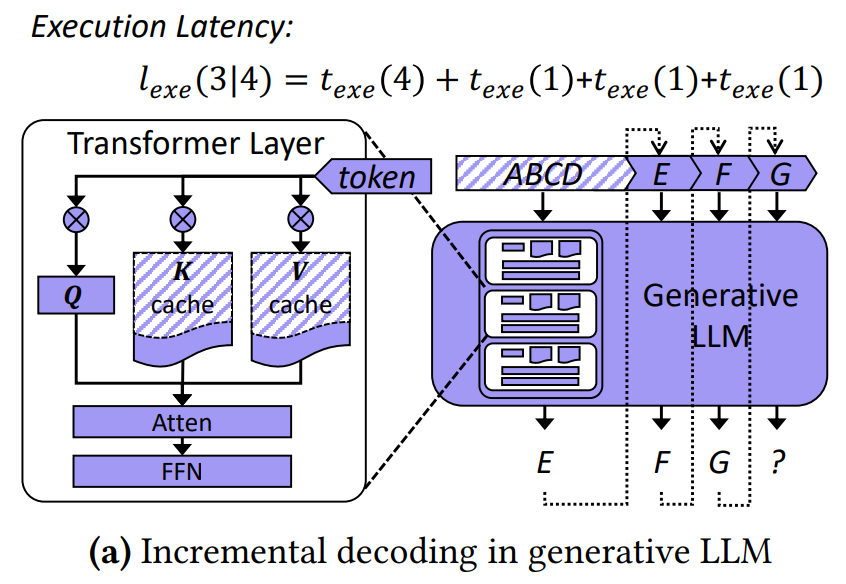
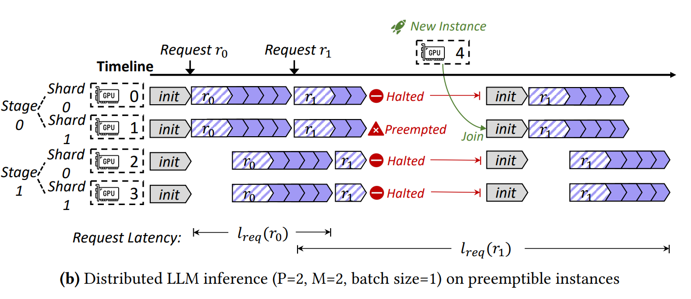
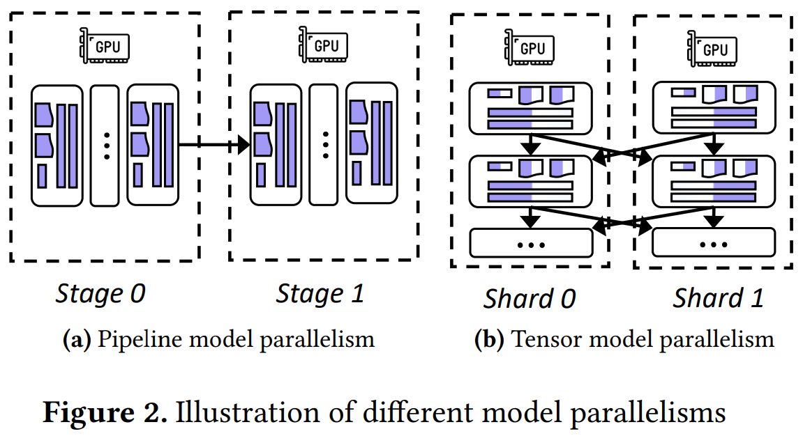
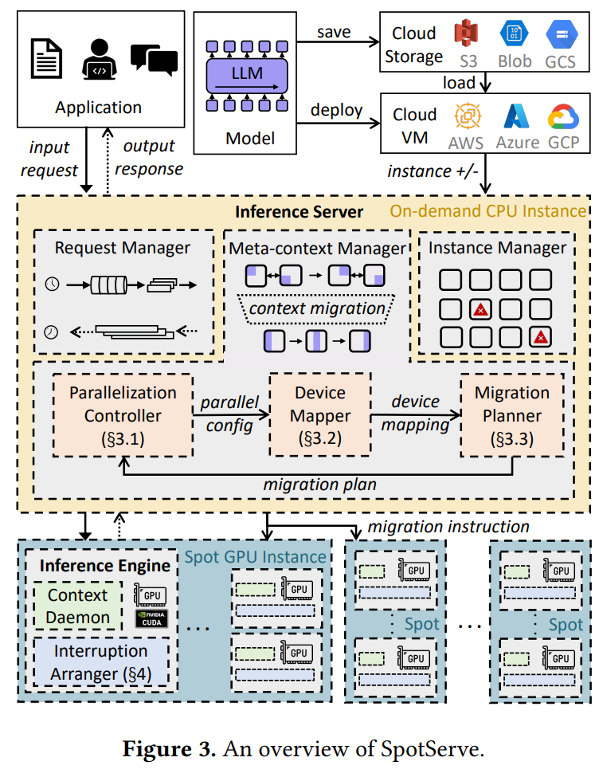
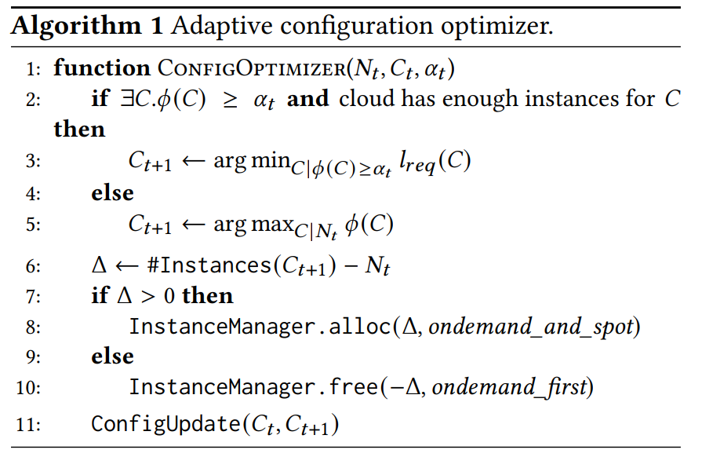
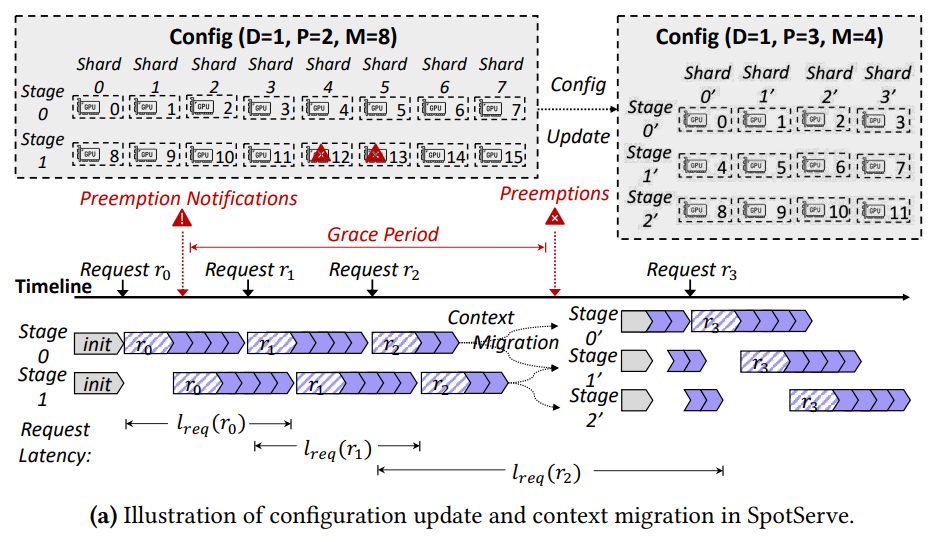
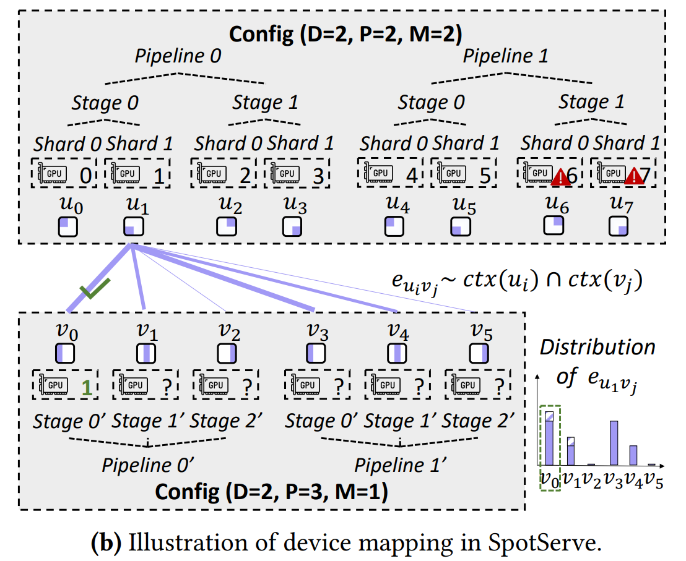
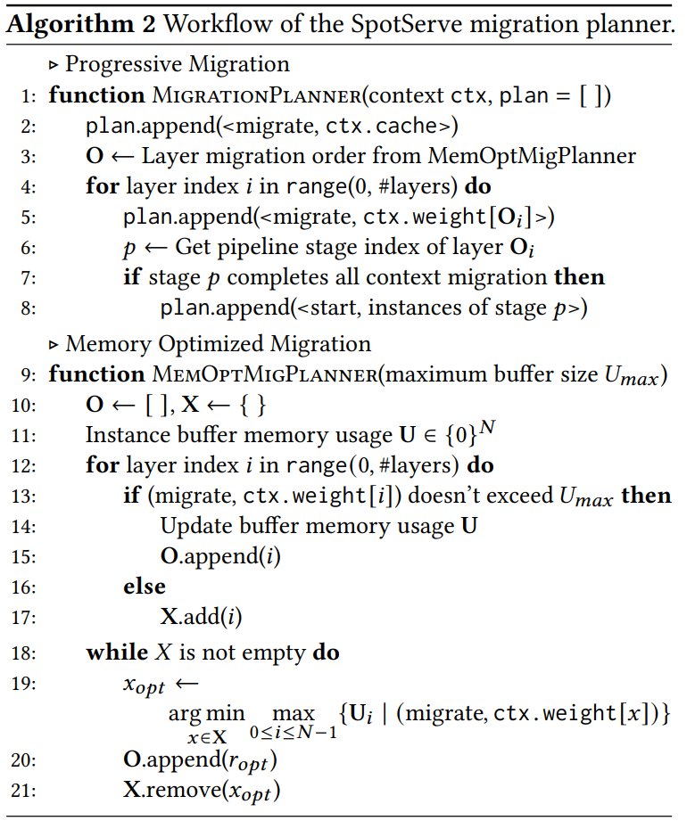

# SpotServe

DOI: <https://doi.org/10.48550/arXiv.2311.15566>

Subjects: `cs.DC` `cs.CL` `cs.LG`

## 摘要

高计算与内存需求使得 LLM 部署成本颇高。
本文旨在通过利用现代云端的可抢占型 GPU 实例来降低部署 LLM 的货币成本。
这些服务器实例仅提供对闲置 GPU 资源的使用，因此它们比常规实例价格偏低。
因为仅能获取闲置 GPU 资源，所以对应 GPU 资源随时可能被云服务商占用。

如果要在可抢占的环境下部署 LLM，就需要解决 **频繁抢占** 和 为解决抢占而产生的必要的 **服务迁移** 这两个问题带来的挑战。

本文提出了第一个可抢占型实例下的分布式 LLM 服务系统，SpotServe。
为实现该技术，使用了如下几个关键技术：

- 动态调整 LLM 的 Parallel Configuration，以适应动态的实例可用性和波动的工作负载，得到在整体吞吐，推理延迟与货币成本之间的平衡
- 为极小化实例迁移成本，实例迁移的任务被形式化描述为二分图匹配问题，并使用 Kuhn-Munkres 算法来得到最优迁移计划，最大限度地降低通信成本
- 利用现代云服务平台提供的 Grace Period，引入了 Stateful Inference Recovery —— 它以更精细的粒度提交推理进度，并允许服务在被抢占时能够以廉价地成本恢复推理

代码开源在：<https://github.com/Hsword/SpotServe>

与现有的 LLM 服务系统对比，减少了 2.4 - 9.1x 的 P99 尾延迟。
相比使用按需型实例，SpotServe 利用可抢占型实例的廉价优点节约了 54% 的货币成本。

## 背景

LLM 推理延迟可以粗略的计算为初始长度计算延迟加输出的每个 Token 单独的延迟。

$$
l_{exe}(S_{out} | S_{in}) = t_{exe}(S_{in}) + \sum^{S_{out}}_{i = 1}t_{exe}(S_{in} + i)
$$

> [!TIP]
> 颜色对应上，Q 只需要每次每次新加入的 v 做运算 `v * Wq` 得到，所以 Q 不需要做 Cache。
> KV 只需要计算出新的 v 对应的 KV，然后和 KV Cache 里的数据进行连接即可得到。

由于 KV Cache 的存在，实际上每次延迟可以被降低到：

$$
l_{exe}(S_{out} | S_{in}) = t_{exe}(S_{in}) + {S_{out}} \times t_{exe}(1)
$$

## 介绍

**生成式 LLM 部署成本高昂**，例如 GPT-3 有 175b 的参数，如果以单精度浮点数形式存储，需要 16 块 `Nvidia A100-40GB GPU`。
为了能够更有效率的利用资源，可以将资源分散给不同的实例，每个实例只做一部分推理，这样让多个实例构成一组推理流水线。
因此为了提供单条 GPT-3 推理流水线，需要在 AWS 上以 66$/h 的价格租赁实例。
随着 LLM 变大，对于大多数预算有限的组织来说，成本会变得难以承担。

现代云服务商会提供 **可抢占型 GPU 实例**（比如 AWS 的竞价型实例，Spot Instance），比一般的按需型实例低，高达 90% 的价格。
竞价型实例随时可以其他有需求的实例抢占。
当一个竞价型实例被抢占时候，现代云会提供一段 **Grace Period**（AWS 的竞价型实例一般会有 30s 的 Grace Period），让实例有时间能够结束运行并停下。

> [!TIP]
> [Spot Instance](https://aws.amazon.com/cn/blogs/china/amazon-ec2-spot-instance-detail/)（竞价型实例），顾名思义，需要通过竞价获取实例。
> 其主要特点就是：
> 
> 1. 实例价格随供需随时变化；
> 2. 该实例可能会被 Amazon EC2 中断（如果您设置的最高价不够高或者Spot实例的容量不够时）；
> 
> 其最大优势就是价格便宜，可以让客户无需预付即可购买计算容量，其小时费率也通常低于按需实例的费率。

已有的利用竞价型实例提供 DNN 服务系统的工作，比如 [MArk](https://www.usenix.org/conference/atc19/presentation/zhang-chengliang)，[Cocktail](https://www.usenix.org/conference/nsdi22/presentation/gunasekaran) 是针对于可以在单个竞价型实例运行的小 DNN 模型设计的。
它们一般需要一个或者多个 GPU 资源，使用修改请求路由（Request Rerouting）或者冗余计算（Redundant Computation）的方法解决抢占问题。

因为在 LLM 服务系统里，抢占不再是独立地，且每一次抢占都会影响同推理流水线的其他实例的运行，所以上述办法并不适合 LLM 的体量，需要更加有效率的办法。

主要挑战有：

1. 动态重并行化（Dynamic Reparallelization）
2. 低成本实例迁移（Instance Migration）
3. 高效利用 Grace Period

示意图，`P=2, M=2, batch size=1`：

### 动态重并行化

为了能够充分利用资源，LLM 服务需要在多个 GPU 上并行化参数存取和计算。
因此，需要组合算子内和算子间的并行策略。
由于竞价型实例的特点，可用实例数量并不固定。
所以需要动态的调整 Parallel Configuration，修改算子并行策略。

算子间的并行化，主要以流水线模型并行（Pipeline Model Parallelism）为主。
它将算子按照数据依赖分组成不同阶段（Stages）。

算子内的并行化，主要以张量模型并行（Tensor Model Parallelism）为主。
它将算子切分为 Shards，分到不同的设备上进行运算。
设备间并行计算，有必要会通过通信进行合作，比如 All-Reduce。

为了解决这个问题，
SpotServe 的 Parallelization Controller 会按照实例数量的变化动态调整并行化策略。

### 实例迁移

并行化策略修改后，需要对 GPU 实例进行迁移以实现新的并行化策略。
这需要重新初始化所有竞价型实例，建立新的通信组。
基于小型 DNN 模型的办法并不适用于 LLM，单单 120b 参数从持久性存储加载出就需要 2min。

为了解决这个问题，
SpotServe 会尝试（Opportunistically ...）重复利用模型参数和中间结果（比如 KV Cache），以减少不必要的实例间通信。
同时，其还将可用的竞价型节点映射到并行化策略的 Device Mesh 这项任务形式化描述为一个二分图匹配匹配问题，并使用 KM 算法就可以计算出最小的迁移成本。
SpotServe 的 Migration Planner 会利用流水阶段的线性执行序，用推理计算来覆盖实例迁移。

### Grace Period

为了高效利用 Grace Period，SpotServe 利用 LLM 天生的自回归（Autoregressive）能力，引入了 Stateful Inference Recovery。
该方法允许推理引擎（Inference Engine）能够以 Token 为单位（Token Level）提交进度，而不需要与过去一样以请求为单位（Request Level）。
SpotServe 推理引擎使用 **Just-In-Time Arrangement** 的办法来确定什么时候将已经提交的 Token 的 KV Cache 迁移给其他可用实例。

## SpotServe 设计

实例抢占引发的推理延迟的增加主要表现在三方面：

1. 一旦抢占发生，整个流水线都会停顿，可能会产生请求的等待开销和/或请求的调度开销（例如重新路由到另一条推理流水线上）
2. 在新实例加入后，还有必要的系统初始化代价，比如启动分布式推理引擎和加载模型参数
3. 整个抢占过程会放大期间累积的后续到来的请求的推理延迟

SpotServe 尝试从以下几个方面减轻端到端推理延迟上的这些问题：

1. 为减少新实例加入而引发的等待时间，SpotServe 提高了按需型实例之间的集成度，以保证迅速的实例获取
2. 为减少重新初始化的运行时开销，SpotServe 引入了高效地上下文管理机制，利用实例间网络连接来保证推理进程（以 KV Cache 形式），减少代价高昂的模型参数重加载
3. 为在节点可用性的波动中取得服务吞吐，延迟和货币代价之间的平衡，SpotServe 采用了一个工作负载感知自适应配置优化算法（Workload-Aware Adaptive Configuration Optimization Algorithm），动态选择最佳 Parallel Configuration，实现实时动态上下文迁移和无缝配置转换

SpotServe 部署在专用的按需型 CPU 实例上，运行了 Request Manager，Meta-Context Manager，Instance Manager。

**Request Manager** 接受输入的请求，动态地将它们分成几个 batch，并将这些 batch 交给竞价型 GPU 实例上的推理实例上。最后从推理实例上收集生成的输出，发送回用户。

**Instance Manager** 和云端进行交互，接收有关实例抢占/获取的信息。

SpotServe 的推理引擎部署在竞价型或者按需型 GPU 实例上，以提供 LLM 推理服务。
每一个推理引擎都包含一个 **Context Daemon**，该程序会在指定的一块 GPU 上管理模型参数和不同请求的中间激活值（Intermediate Activations）。
推理引擎可以通过 Context Daemon 的代理获取这些上下文信息。
如果推理引擎由于其所依赖的引擎被抢占而被打断，Context Daemon 依然会保持活跃，从而避免在重启推理时，重新加载上下文信息到 GPU 里。

当系统服务的能力（Capability）和工作负载已经或者即将不匹配，**Meta-Context Manager** 会通过向所有的 GPU 发送迁移指令（Migration Instruction），来调整 Parallel Configuration。
新的配置是由 **Parallelization Controller** 发出，由 **Device Mapper** 和 **Migration Planner** 在物理上完成。
为了更低的推理延迟，每个推理引擎也会启动一个 **Interruption Arranger**，来支持 Stateful Inference Recovery。

### Parallelization Controller

SpotServe 使用 Parallel Configuration 来确定一个在多 GPU 实例下的一个并行化 LLM 服务的策略。
一个 Parallel Configuration 以一个元组 `C = (D, P, M, B)` 的形式表现，其中 D，P，M 分别表示数据、流水线模型和张量模型的并行度，B 表示最大的 Mini-Batch 大小。

透过云服务有关实例抢占/获取的提前通知，SpotServe 可以主动的调整 Parallel Configuration，这是与当下的竞价型实例服务系统的一个关键性的不同点。
这种重并行化机制也可以自适应浮动的推理工作负载，这已经在 MArk 里被研究完成了。

竞价型实例在被获取时虽然没有的 Grace Period，但是依然会花费相当一段时间进行初始化，这段时间可以提前测量并当作获取时的 Grace Period。

自适应配置优化器（Adaptive Configuration Optimizer）使用自适应优化算法来平衡吞吐、延迟和代价。
定义两个随时间变化的变量 $C_t$ 和 $N_t$ 来表示 $t$ 时间时候的 Parallel Configuration 和可用实例的数量。
注意，这里的 $N_t$ 认为实例均在 Grace Period 中，这包括新分配的实例，不包括被抢占的实例。
让 $\phi(C)$ 作为 Parallel Configuration 为 $C$ 时候的服务吞吐，$\alpha_t$ 作为 $t$ 时刻的请求到达率（Request Arrival Rate）。（由于到达率是随机的，该到达率为估计值）

以下算法，展现了优化器的工作流程。
该算法主要在实例可用性或工作负载变化后，服务能力与 $\alpha_t$ 不匹配的时候工作。

总的来说，优化器目的是最小化端到端的推理延迟 $l_{req}(C)$ 的同时保证吞吐高于请求到达率。
尤其当有多种配置可以选择时，SpotServe 会尝试选择货币成本相对低的方案。
事实上，优化器还能满足相容的其他指标，比如预定义的 SLO（Service Level Object）延迟要求。

- 当 SpotServe 的最高服务吞吐不能超过请求到达率的时候，其会尝试最大化整体服务吞吐
- 当新的配置要求的实例与原先不同
  - 获取新实例的时候会尝试同时从按需型和竞价型实例中获取新的实例，这样可以避免竞价型实例获取失败导致的等待开销
  - 放弃旧实例的时候会尝试优先放弃按需型实例，以降低货币成本
- 为应对频繁变换的实例可用性，SpotServe 会预留额外几个实例在备选池中以更顺利地进行实例替换
- 即便配置不一定会变化，由于抢占和获取的产生，实例会产生变化，需要 Interruption Arranger 决定何时完成重并行化

优化器在线运行，并且由于不同配置的延迟评估是 **提前在线下完成** 的，实际开销微不足道（< 1s）。
SpotServe 的配置搜索空间相对之前的方法更大，同时也可能能扩展到更复杂的模型并行上。（as Future Work）

### Device Mapper

降低迁移引发延迟的关键挑战：
将可用 GPU 实例映射到新的并行配置所确定的逻辑 Device Mesh 上，以尝试重复利用已有的上下文信息。

简化考虑元组 `C = (D, P, M)`，定义不变。
可以用 `(d, p, m)` 确定设备的 Pipeline-Stage-Shard 拓扑位置，意味着设备映射在第 `d` 条流水线中的阶段 `p` 上的第 `m` shard 上。

SpotServe 使用二分图 $\mathcal{G} = (\mathcal{V_a}, \mathcal{V_t},\mathcal{E})$ 来描述设备的映射关系。
节点 $\mathcal{u} \in \mathcal{V_a}$ 代表 GPU 设备。
节点 $\mathcal{v} \in \mathcal{V_t}$ 代表 Parallel Configuration 的一个 Pipeline-Stage-Shard 拓扑位置。
权重边 $\mathcal{e_{uv}}$ 表示 $u$ 映射到 $v$ 时可重用的上下文数量。

例如：

图中 $u_1$ 映射到 $v_0$ 拥有最多的可重用上下文（权重，KV Cache），故选择该映射最佳。
该问题可以使用 KM 算法得到一个权重最大的二分图匹配。

### Migration Planner

问题：

1. 大模型全迁移时间会过长
2. 上下文通信使用的 buffer 内存开销非常大

SpotServe 使用两个算法分别解决这两个问题。

Progressive Migration 调度算法利用流水线结构，有限迁移位于模型流水线前段的层的上下文。

前段的层迁移后可以直接开始服务，并可以用启动运行时间覆盖后段层的迁移时间。
故而理想状态下，整体开销只有一个层的迁移时间。
为了能够对打断有一定的容错性，会尝试优先迁移上下文中 Cache 的内容，以减少解码过程中可能的损失。

Memory Optimized Migration 调度算法按序处理需要迁移的层，并追踪每一个实例的 buffer 内存使用情况。
该算法需要一个默认超参 $\mathcal{U_{max}}$ 来表示每个实例最大的 buffer 内存消耗阈值。

首先忽略所有上下文迁移中可能超出 buffer 内存上限的层，然后求解一个 min-max 问题以生成其余层的顺序。
该算法倾向于选择上下文迁移能最大程度减少最大实例 buffer 内存使用的层，这样组合的层上下文迁移顺序具有更低的内存消耗。

## Stateful Inference Recovery

Stateful Inference Recovery 推理机制可以让 SpotServe 在不需要进行重计算的情况下恢复被打断的推理请求。

### Just-In-Time Arrangement

如果以请求的为单位迁移，那么需要迁移的时候，常规办法会立刻挂起推理引擎，导致实例上的所有活跃请求都被暂停，然后重新路由到新的推理流水线上重新启动。
这会引发非常高的端到端推理延迟，即便是选择优先将任务完成再迁移，也会因为时间不够而无法完全完成迁移。

SpotServe 则选择尝试以 Token 为单位进行迁移，这样子可以允许在解码迭代的任何增量阶段被打断。
SoptServe 的 Context Daemon 会保存推理请求的状态信息（比如 Cache 上下文），这样请求被重新路由到另一个推理流水线上的时候，就可以直接从之前的上下文信息开始继续进行推理，而不需要对之前生成的 Token 做重计算。

为了确定 Grace Period 期间可以运行多少次迭代，SpotServe 采用 Just-In-Time Arrangement 并让推理引擎决定何时停止解码。
具体来说，每个竞价型 GPU 节点的 Interruption Arranger 会接收到 Grace Period 开始信息，并基于这个消息，检查在接受下一组输入请求前还剩余多少时间推理。

假设请求在 t 时刻准备好，SpotServe 会基于请求类型以不同方式计算解码迭代次数。

实例被抢占时，迭代次数 $S_t$ 计算：

$$
S_t = \argmax_{0 \leq S \leq S_{out}} \{ l_{exe}(S | C_t) < T^- - T_{mig} \}
$$

有实例加入时，迭代次数 $S_t$ 计算：

$$
S_t = \argmax_{0 \leq S \leq S_{out}} \{ l_{exe}(S | C_t) \geq T_+ \}
$$

$l_{exe}(S | C_t)$ 指 $C_t$ 配置下，生成 S 个 Token 的运行延迟。
$T^-$ 是抢占后剩余的 Grace Period 时间。
$T^+$ 是获取实例后的 Grace Period 时间（比如初始化时间）。
$T_{mig}$ 是迁移所需要的时间。

两种算法都要保证安排不会增加请求延迟。比如 $T_{mig} < l_{exe}(S_t | C_t)$。

###  Interruption Fault-Tolerance

使用的机制如下：

1. 推迟获取实例的加入，让对先前中断的安排完成
2. 如果有实例在预期前被抢占，SpotServe 会放弃 Cache 上下文，只迁移模型上下文，

如果发生了某部分模型参数的副本完全丢失，便会从本地（比如磁盘）或者远端存储重新加载必要的模型参数。
